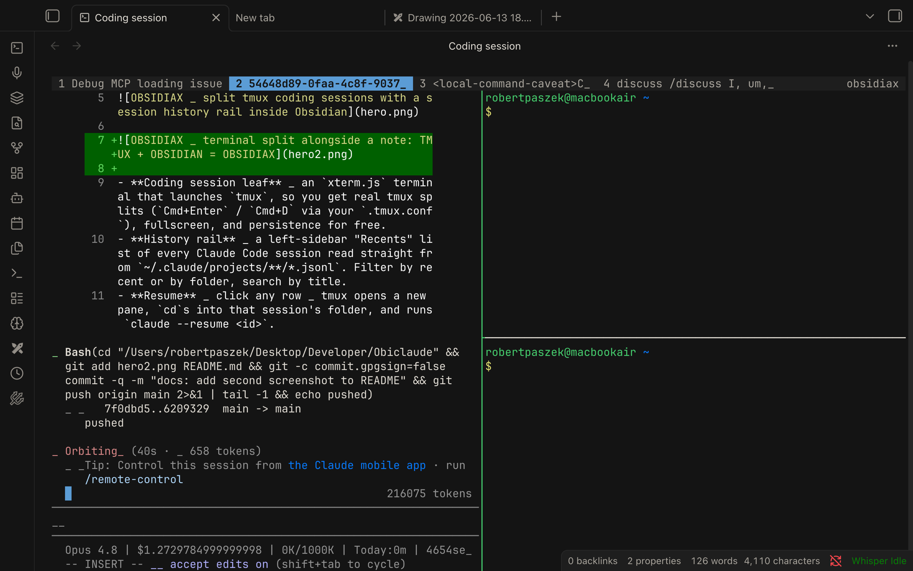
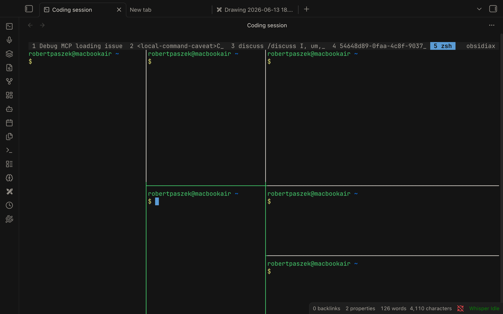

# OBSIDIAX

tmux inside Obsidian, plus a history rail that resumes your past Claude Code sessions.





- **Coding session leaf** — an `xterm.js` terminal that launches `tmux`, so you get real tmux splits (`Cmd+Enter` / `Cmd+D` via your `.tmux.conf`), fullscreen, and persistence for free.
- **History rail** — a left-sidebar "Recents" list of every Claude Code session read straight from `~/.claude/projects/**/*.jsonl`. Filter by recent or by folder, search by title.
- **Resume** — click any row → tmux opens a new pane, `cd`s into that session's folder, and runs `claude --resume <id>`.

## Architecture

```
xterm.js  ──>  PTYBridge (swappable)  ──>  $SHELL ──> tmux SERVER (daemon, outlives Obsidian)
   ^                                                      └─ panes running `claude`
   │
HistoryRail ── reads ~/.claude/*.jsonl ── click ──> tmux split-window 'claude --resume <id>'
```

The PTY is the only real engineering risk, so it lives behind `PTYBridge`
(`src/pty/`). Today: `NodePtyBridge`. Swap in a Rust `portable-pty` host later
by implementing the same interface — nothing else changes.

## Install (dev)

```bash
npm install
npm run build          # produces main.js
```

Then symlink/copy `main.js`, `manifest.json`, `styles.css` into
`<vault>/.obsidian/plugins/obsidiax/` and enable the plugin.

### node-pty native module

`node-pty` must match Obsidian's **Electron ABI**, not your system Node. If the
terminal shows a load error, rebuild it against Obsidian's Electron:

```bash
npx @electron/rebuild -v <obsidian-electron-version> -f -w node-pty
```

(That ABI friction is exactly why the Rust host is the planned next step.)

## Requires

`tmux` and the `claude` CLI on your `PATH`. Desktop only.
